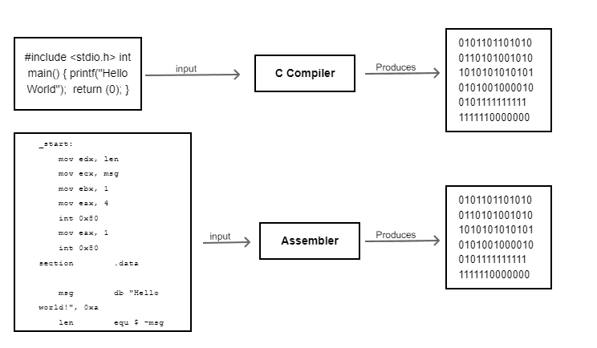
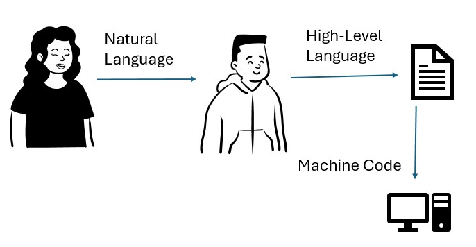

# Resumen acerca del libro: El lenguaje electrónico de David Bolter.

    <b>“La escritura es en sí misma una revolución tecnológica”.</b>

La afirmación que realizó Alan Turing en su trabajo de 1950 “” ha tenido su progresiva demostración a través de los años con el auge de la inteligencia artificial, hoy en día muchas tareas exclusivas de la mente humana han pasado a ser realizadas por las máquinas.

A principios del siglo en México el FCE (Fondo de cultura económica) puso a la venta una colección de títulos para que el público en general pudiera acercarse a las ciencias y a las humanidades, esta colección se llama Fondo 2000.
Entre esos títulos hay uno que he encontrado muy llamativo, titulado “El lenguaje electrónico” por David Bolter (a lo que se refiere el título es lo comúnmente conocido como Lenguaje de programación).    

<b>Fig 1.  Portada del libro “El lenguaje electrónico”</b>

En esta obra Bolter afirma que la computadora es un medio de comunicación y una herramienta científica, estas dos naturalezas permiten que sea usada tanto por los profesionales de humanidades y los técnicos (humanistas y científicos) en palabras de Butler.

Las afirmaciones de Butler confirman que la memoria electrónica no atenta contra la memoria humana así como la enciclopedia no arruinó la imaginación de los hombres.
Un lenguaje de programación a nivel práctico son códigos cuyo propósito es solucionar problemas técnicos utilizando estructuras lógicas.

Aunque diferente con el lenguaje natural que utilizamos en la vida diaria, los lenguajes electrónicos tienen  raíces filosóficas que remontan al siglo XVII e inclusive hasta Aristoteles. El punto común entre los humanistas como poetas o filósofos y los técnicos (programadores de computadora y desarrolladores de software) es que el lenguaje proporciona una vía al conocimiento.
El lenguaje electrónico como lo describe Butler es una metáfora ya que es una herramienta de comunicación con la máquina, así como utilizamos el lenguaje natural para comunicarnos entre nosotros, aunque ambos hayan sido creación humana la diferencia es obvia: el lenguaje natural está vivo.

<b>Fig 2. Diferencias entre lenguaje natural y lenguaje electrónico.</b>

El objetivo de todos los lenguajes de programación de propósito general es crear una máquina de Turing. 
Los lenguajes de programación van dirigidos a dos tipos de público: 
Quienes ejecutan el programa y quienes le dan mantenimiento.
Para quienes le dan el mantenimiento se colocan comentarios en lenguaje natural.
Es inevitable que los códigos (palabras reservadas) de los lenguajes de programación sean en un lenguaje natural, por mayoría y por razones comerciales es el inglés.

<h3>Jerarquía del lenguaje electrónico</h3>

Los lenguajes de programación están diseñados jerárquicamente en lenguajes de alto nivel, lenguajes ensambladores. Esta jerarquía se basa en términos de su distancia con el hardware y su cercanía con un lenguaje formal incluso más parecido al lenguaje humano.

<b>Fig 3. Jerarquía de lenguajes de programación.</b>

Los lenguajes de bajo nivel (Ensambladores) aprovechan los recursos mnemotécnicos, nombres cortos y fijos (AD, SUB, MUL) además de que se pueden crear nuevos nombres para indicar espacios de almacenamiento en memoria o sea variables en el sentido matemático.
Estos lenguajes ensambladores son traducidos inmediatamente a dígitos binarios mediante un programa de traducción llamado ensamblador.
Por otro lado, los lenguajes de alto nivel permiten escribir programas en un lenguaje más lógico (parecido a las matemáticas y acercándose al lenguaje natural) y son traducidos a dígitos binarios por un programa llamado compilador.
Los compiladores son básicamente programas de traducción, aceptan un lenguaje de alto nivel como input y producen instrucciones output por medio de algoritmos.

<b>Fig 4  Esquemas de compilación</b>

A diferencia del lenguaje natural hablado en donde el significado de una frase puede ser alterado por la frase siguiente, en el lenguaje de programación todo tiene significado en la acción es decir en la ejecución del código en la máquina, por ese motivo no se permite la ambigüedad.

En un lenguaje natural la expresión escrita no es la parte más importante del lenguaje en contraste los lenguajes de programación han sido diseñados por matemáticos y lógicos para la solución de problemas técnicos. 

<h3>Poesía y lógica</h3>

En el mundo de la programación el pensamiento desciende al nivel del lenguaje.

<b>Fig 5 Pasos del lenguaje para un programa de computadora</b>

En la escritura se produce una actitud lógica hacia el lenguaje ya que se crean estructuras que pueden ser analizadas a diferencia del lenguaje oral; por esa razón la poesía se escribe para ser recitada.
La frase impresa o escrita se presta muy bien al análisis estructural ya que el ojo puede repasar la palabra escrita varias veces y eso permite reflexionar sobre la función gramatical.

