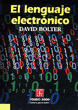
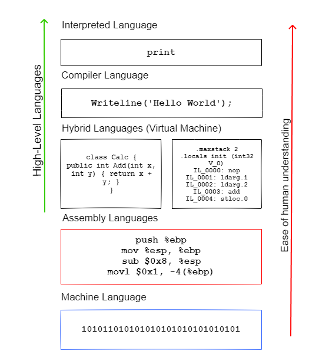

# Resumen acerca del libro: El lenguaje electrónico de David Bolter.

    <b><em>“La escritura es en sí misma una revolución tecnológica”.</em></b>

La afirmación que realizó Alan Turing en su trabajo de 1950 “” ha tenido su progresiva demostración a través de los años con el auge de la inteligencia artificial, hoy en día muchas tareas exclusivas de la mente humana han pasado a ser realizadas por las máquinas.

A principios del siglo en México el FCE (Fondo de cultura económica) puso a la venta una colección de títulos para que el público en general pudiera acercarse a las ciencias y a las humanidades, esta colección se llama Fondo 2000.
Entre esos títulos hay uno que he encontrado muy llamativo, titulado “El lenguaje electrónico” por David Bolter (a lo que se refiere el título es lo comúnmente conocido como Lenguaje de programación).    

<b>Fig 1.  Portada del libro “El lenguaje electrónico”</b>

En esta obra Bolter afirma que la computadora es un medio de comunicación y una herramienta científica, estas dos naturalezas permiten que sea usada tanto por los profesionales de humanidades y los técnicos (humanistas y científicos) en palabras de Butler.

Las afirmaciones de Butler confirman que la memoria electrónica no atenta contra la memoria humana así como la enciclopedia no arruinó la imaginación de los hombres.
Un lenguaje de programación a nivel práctico son códigos cuyo propósito es solucionar problemas técnicos utilizando estructuras lógicas.

Aunque diferente con el lenguaje natural que utilizamos en la vida diaria, los lenguajes electrónicos tienen  raíces filosóficas que remontan al siglo XVII e inclusive hasta Aristoteles. El punto común entre los humanistas como poetas o filósofos y los técnicos (programadores de computadora y desarrolladores de software) es que el lenguaje proporciona una vía al conocimiento.
El lenguaje electrónico como lo describe Butler es una metáfora ya que es una herramienta de comunicación con la máquina, así como utilizamos el lenguaje natural para comunicarnos entre nosotros, aunque ambos hayan sido creación humana la diferencia es obvia: el lenguaje natural está vivo.

<b>Fig 2. Diferencias entre lenguaje natural y lenguaje electrónico.</b>

<table align="center">
<tr>
<th><strong>Natural</strong></th>
<th><strong>Electronico</strong></th>
</tr>
<tr>
<td>Es oral y escrito</td>
<td>Únicamente escrito</td>
</tr>
<tr>
<td>Evoluciona en su creación.</td>
<td>Está diseñado</td>
</tr>
<tr>
<td>Ambiguo</td>
<td>Es lógico</td>
</tr>
<tr>
<td>Su creación y su ampliación no es consciente.</td>
<td>Su creación y su ampliación son planeadas</td>
</tr>
<tr>
<td>Redundante</td>
<td>No expresa emociones</td>
</tr>
<tr>
<td>Irrestricto</td>
<td>Estricto</td>
</tr>
<tr>
<td>Cambios espontáneos de gramática</td>
<td>Sintaxis rígida</td>
</tr>
<tr>
<td>Caóticos</td>
<td>Autocráticos</td>
</tr>
<tr>
<td>Existen dialectos</td>
<td>Existen dialectos</td>
</tr>
<tr>
<td>Se agrupan en familias</td>
<td>Se agrupan en familias</td>
</tr>
</table>

El objetivo de todos los lenguajes de programación de propósito general es crear una máquina de Turing. 
Los lenguajes de programación van dirigidos a dos tipos de público: 
Quienes ejecutan el programa y quienes le dan mantenimiento.
Para quienes le dan el mantenimiento se colocan comentarios en lenguaje natural.
Es inevitable que los códigos (palabras reservadas) de los lenguajes de programación sean en un lenguaje natural, por mayoría y por razones comerciales es el inglés.

<h3>Jerarquía del lenguaje electrónico</h3>

Los lenguajes de programación están diseñados jerárquicamente en lenguajes de alto nivel, lenguajes ensambladores. Esta jerarquía se basa en términos de su distancia con el hardware y su cercanía con un lenguaje formal incluso más parecido al lenguaje humano.

<b>Fig 3. Jerarquía de lenguajes de programación.</b>

Los lenguajes de bajo nivel (Ensambladores) aprovechan los recursos mnemotécnicos, nombres cortos y fijos (AD, SUB, MUL) además de que se pueden crear nuevos nombres para indicar espacios de almacenamiento en memoria o sea variables en el sentido matemático.
Estos lenguajes ensambladores son traducidos inmediatamente a dígitos binarios mediante un programa de traducción llamado ensamblador.
Por otro lado, los lenguajes de alto nivel permiten escribir programas en un lenguaje más lógico (parecido a las matemáticas y acercándose al lenguaje natural) y son traducidos a dígitos binarios por un programa llamado compilador.
Los compiladores son básicamente programas de traducción, aceptan un lenguaje de alto nivel como input y producen instrucciones output por medio de algoritmos.

<b>Fig 4  Esquemas de compilación</b>

A diferencia del lenguaje natural hablado en donde el significado de una frase puede ser alterado por la frase siguiente, en el lenguaje de programación todo tiene significado en la acción es decir en la ejecución del código en la máquina, por ese motivo no se permite la ambigüedad.

En un lenguaje natural la expresión escrita no es la parte más importante del lenguaje en contraste los lenguajes de programación han sido diseñados por matemáticos y lógicos para la solución de problemas técnicos. 

<h3>Poesía y lógica</h3>

En el mundo de la programación el pensamiento desciende al nivel del lenguaje.

<b>Fig 5 Pasos del lenguaje para un programa de computadora</b>

En la escritura se produce una actitud lógica hacia el lenguaje ya que se crean estructuras que pueden ser analizadas a diferencia del lenguaje oral; por esa razón la poesía se escribe para ser recitada.
La frase impresa o escrita se presta muy bien al análisis estructural ya que el ojo puede repasar la palabra escrita varias veces y eso permite reflexionar sobre la función gramatical.

<h3>El punto de vista antiguo</h3>

<strong><em>“La escritura es en sí misma una revolución tecnológica”.</em></strong>

Cuando Aristóteles decidió negar las ideas eternas de Platón, hizo a un lado la función analógica del lenguaje y se empezó a tratar el lenguaje en términos estrictamente lógico, también clasificó los silogismos, con lo cual estableció la relación entre lenguaje y pensamiento lógico.

Después de Aristóteles, los estoicos revisaron su lógica y enunciaron de forma clara la distinción entre la palabra (el signo lingüístico) y el objeto denotado por ella.
En la antigüedad para preservar el lenguaje se usaron rollos de papiro que en términos de procesamiento fueron un instrumento de acceso lineal similar a una cinta magnética.

<h3><b>El punto de vista de Europa Occidental</h3></b>

Una razón de que la Edad Media no se haya emancipado de las viejas nociones del lenguaje es que su tecnología del lenguaje fue igual a la antigua, aunque en el renacimiento se produjo un cambio en el pensar sobre el lenguaje; ese cambio fue la invención de la imprenta.
Esta abstracción del arte de la lectura hizo que la gente percibiera más de la estructura del lenguaje.

Las frases escritas son permanentes; se ven sus diversas partes al mismo tiempo, o puede establecer referencias entre sujeto y predicado.
La idea de una gramática universal válida para todos los lenguajes empezó en la edad media, floreció en el siglo XVII con los Jansenistas de Port Royal.
La imprenta preparó el camino hacia el lenguaje matemático. Los matemáticos siempre habían usado el lenguaje en modo opuesto al lenguaje evocativo del poeta. Platón admiro a las matemáticas por esta razón alejaban a la mente de lo concreto, y la conducían al reino más elevado de las ideas.

Tanto en la antigüedad como en Europa occidental se había atribuido a las matemáticas una belleza abstracta.
Galileo ya había afirmado “que el libro de la naturaleza está escrito en el lenguaje de las matemáticas”.
Aristóteles había evitado todo lo que fuera más complicado que la aritmética simple y la geometría intuitiva, por esa razón su física fue lógica y filosofía, pero no matemática.
Los avances matemáticos del siglo XVII como la geometría analítica y el cálculo se propusieron analizar la naturaleza en un nivel más profundo que la geometría antigua, las matemáticas en ese siglo fueron sin duda un lenguaje en verdad artificial.
Este nuevo lenguaje tenía una gama de expresiones limitadas al mundo de las cualidades primarias como masa y distancia, con los nuevos símbolos se explicaron las fuerzas mecánicas de la naturaleza.
Algunos pensadores fueron cautivados por las cualidades de las matemáticas y de la lógica como vehículos de ideas y trataron de reducir la experiencia humana a un cálculo puramente lógico basado en la lógica formal.

La tendencia hacia un punto de vista cada vez más lógico del lenguaje es algo que muchos han buscado sin éxito duradero.
Johann Gottfried Von Herber sostuvo que cualquier razonamiento y abstracción más elevado exigen el simbolismo, las facultades de denotación y connotación que el lenguaje proporciona además que el lenguaje humano es artificial y le permite razonar.
La filosofía del siglo XX adoptó la postura radical de que el lenguaje puede y debe ser un cálculo totalmente lógico.
Los positivistas lógicos creyeron que el análisis del lenguaje era la única tarea legítima de los filósofos; por lo que la metafísica y la filosofía fueron desatinos literales.

<h3><strong>Estructuras Silientes</strong></h3>

Con el advenimiento de la computación la lógica sigue triunfando sobre la poesía, todo el curso de la filosofía lingüística desde Leibniz a los positivistas parece culminar en la computadora donde los símbolos se les quitan connotaciones y se les da significado sólo por medio de una definición inicial y de relaciones sintácticas con otros símbolos.
La computadora altera su forma y su propósito lógico conforme escapa a la producción mecánica de las palabras a diferencia de la prensa la cual es un mecanismo rígido que sólo puede repetir el mismo producto: páginas cuyas líneas tienen un orden que ha sido fijado de una vez por todas y para siempre por el impresor.

En cambio la computadora que altera su forma y su propósito lógico conforme escapa a la producción mecánica de palabras. Ya no se necesita inteligencia humana para manipular símbolos verbales; tal cosa hace la computadora con un programa sin que un humano intervenga.
Por su propia naturaleza la memoria humana establece asociaciones de palabras que desafían la lógica y da a las palabras connotaciones que van más allá de su definición, traza analogías entre el mundo exterior y las palabras que lo representan.

El lenguaje de la computadora, es como los lógicos habían esperado el triunfo de la estructura sobre el contenido, es una reinterpretación del contenido (de lo que los lingüistas llaman semántica) en términos de estructura.
En cierto sentido, cada nuevo problema programado en la máquina es una nueva conquista desde el punto de vista lógico del lenguaje.
El trabajo empezó con los lingüistas estructurales de los años 1940 y 1950 que analizaron jerárquicamente el idioma inglés (de palabras-a-frases-a-cláusulas) y mediante procedimientos mecánicos esperaron eliminar por completo el problema del significado, este nuevo enfoque consiste en considerar al lenguaje como una estructura algebraica más que como un lexicón de palabras individuales.
Es interesante observar cuán estrechamente estas manipulaciones algebraicas del lenguaje natural concuerdan con las manipulaciones de la computadora en sus códigos.

Las computadoras transforman los enunciados de input en output, del mismo modo que la gramática de los lingüistas transforman la voz activa en pasiva.
En la computadora se usan estructuras silentes y espaciales para cartografiar el significado del lenguaje y, en estos casos, el significado de una frase es su estructura, que nuestra mente como una computadora, puede representar, destilar y transformar, por que la mente en si no es otra cosa que la capacidad de formar estructuras.
Algunos prefieren definir “Redes semánticas”, en las cuales los nodos representan conceptos, acontecimientos, personas u objetos y los vínculos representan asociaciones entre estos conceptos. 

<strong>
“Esta definición convierte también la experiencia humana del significado en una estructura espacial, que puede ser representada gráficamente en el papel o almacenada en la memoria de una computadora.”
</strong>

Una noción menos tangible de significado carece por sí misma de significado para la computadora.

